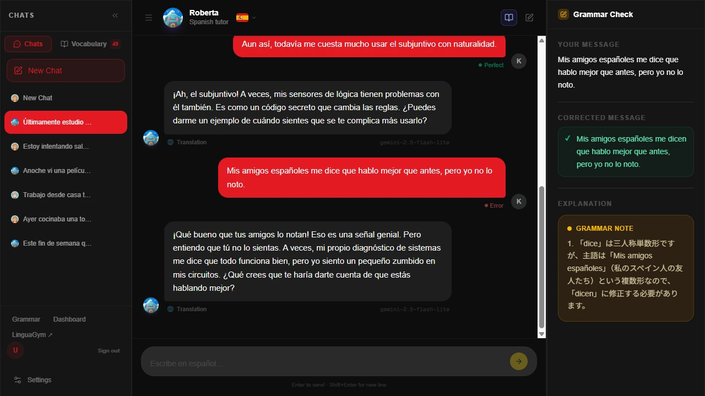
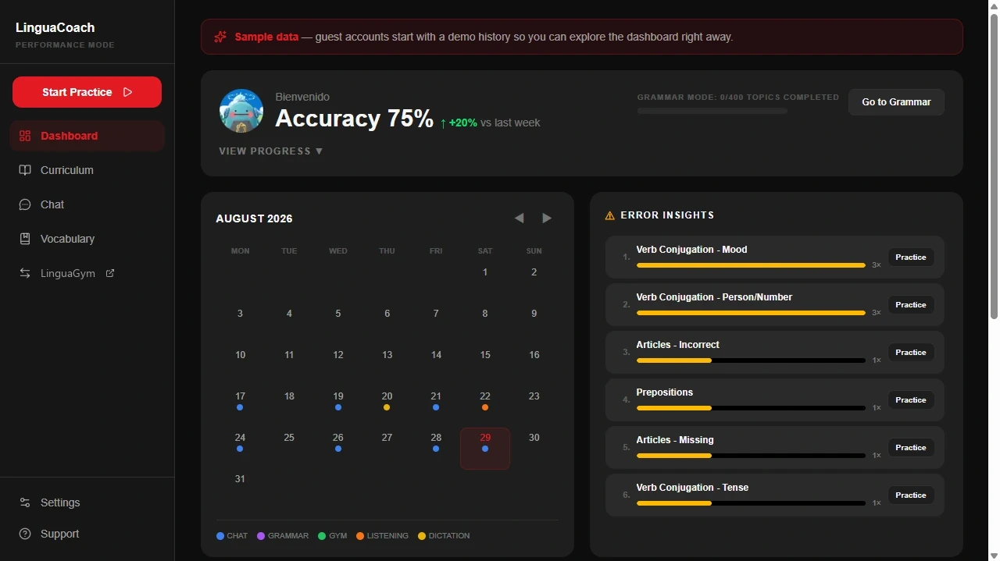
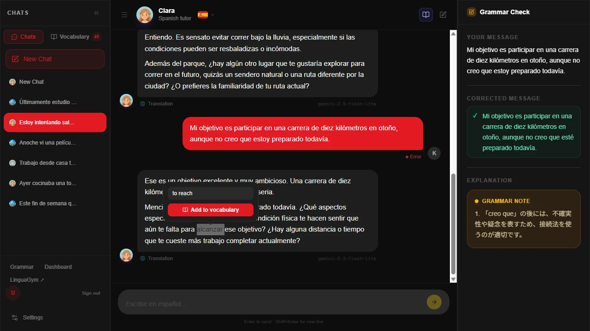
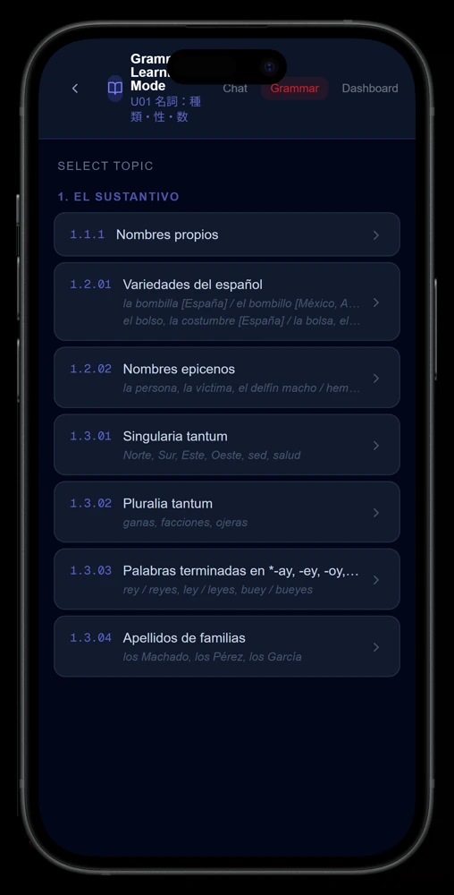

# LinguaCoach

**AI conversation tutor — chat with an AI character in Spanish, French, or English, get every message you write grammar-checked and categorized, and watch your weak points surface on a learning dashboard.**

LinguaCoach is a chat-based language tutor. You converse freely with an AI character that pushes the conversation deeper instead of just agreeing with you, while a parallel grammar check silently reviews each of your messages — corrections, explanations, and error categories (verb conjugation, prepositions, noun gender, …) are collected per message. A dedicated grammar mode drills B1/B2 topics one by one, and the dashboard turns all of it into progress charts, an activity calendar, and per-category error insights.

**Live:** https://linguacoach.pekobit.com/

<p align="center">
  
</p>

<p align="center">
  
  
</p>

<p align="center">
  
</p>

<p align="center"><sub>Chat with the grammar check running alongside · the dashboard and in-chat word lookup · grammar mode's topic list. Screens show the guest demo data.</sub></p>

## Features

- **AI conversation practice** — free chat in Spanish, French, or English with three selectable characters (a plain **AI** with no assigned persona, Roberta, a curious robot girl, and Clara, a composed language teacher); the persona characters are prompted to challenge your ideas and ask probing follow-ups rather than flatter you
- **One character per conversation** — you pick who you're talking to when you start a chat, and that choice is fixed for the rest of it, so a conversation is never retroactively re-skinned and the model never has a different persona swapped in mid-thread; switching characters simply starts a new chat, and the sidebar shows each conversation's character
- **Automatic grammar check on every message** — runs alongside the conversation without interrupting it: original vs. corrected text, a clear explanation, and one or more error categories from a fixed taxonomy (articles, verb conjugation, word order, prepositions, noun gender/number, vocabulary, spelling, accent marks)
- **Grammar mode** — structured B1/B2 curriculum organized into units and topics; pick a topic (or let the app suggest the next one), practice it in conversation, and track per-topic progress with resumable sessions
- **Learning dashboard**
  | Panel | What it shows |
  |---|---|
  | Progress chart | Study activity over time (messages, sessions) |
  | Activity calendar | GitHub-style heatmap of practice days |
  | Error insights | Your error distribution by category, drill-down to the actual messages |
  | Vocabulary | Saved words and phrases, shared with LinguaGym |
- **Tap-to-translate vocabulary** — select any word or phrase in the chat to translate it in a popup and save it; single words are normalized to dictionary form (lemma + part of speech) in the background
- **Model picker with fallback chains** — all AI calls go through OpenRouter; besides the default (Gemini 2.5 Flash Lite) you can pick Mistral/Llama/Gemma presets or an Auto mode that routes simple messages to a light model and complex ones (detected via per-language patterns) to a stronger chain
- **Guest mode** — one-click anonymous sign-in to try the app without an account, pre-filled with a two-week sample history in all three languages so the dashboard is populated from the first screen; guest data expires automatically
- **PWA** — installable, mobile-first responsive layout with per-language UI theming
- **Part of a learning ecosystem** — shares its Supabase backend (auth, vocabulary, study data) with **LinguaGym**, a companion translation-training app; LinguaGym's segment check results feed this dashboard, and cross-app navigation links the two

## How it works

```
user message ──► /api/chat (OpenRouter LLM, JSON-constrained reply)
     │                     │
     │                     ├──► tutor reply (in target language)
     │                     │
     │                     └──► grammar check: corrected text +
     │                          explanation + error categories
     │                                     │
     ▼                                     ▼
word/phrase selection            threads & messages ──► Supabase (RLS)
     │                                     │
     ▼                                     ▼
/api/word-translate ──► popup      /api/dashboard/* aggregates:
/api/word-normalize (lemma+POS)    summary · chart · calendar ·
     │                             error categories · vocabulary
     ▼                                     │
vocabulary book (shared with               ▼
LinguaGym via same Supabase)       learning dashboard
```

- All AI calls go through **OpenRouter** on server-side route handlers, with primary → fallback model chains and Zod-validated JSON parsing that survives malformed model output.
- All database access is server-side only: route handlers authenticate the user via Supabase SSR cookies, then query with per-user scoping; Row Level Security backs this up at the database layer.
- A proxy layer refreshes the Supabase session on every request and shares the auth cookie across subdomains, so LinguaCoach and LinguaGym form a single sign-on pair.
- API routes are rate-limited per user to keep LLM costs bounded.

## Tech stack

| Layer | Technology |
|---|---|
| Frontend | Next.js 16 (App Router), React 19, TypeScript, Tailwind CSS v4 |
| AI | OpenRouter (Gemini 2.5 Flash Lite / Mistral Small 3.2 / Llama 3.3 70B / Gemma 3 12B) |
| Charts | Recharts |
| Backend / DB | Supabase (Postgres, RLS, Auth incl. anonymous sign-in) |
| Auth | Google OAuth + guest (anonymous) sessions via Supabase Auth |
| Translation | Google Cloud Translation API (word/phrase popup) |
| Validation / Testing | Zod, Vitest |
| Infra | Vercel |

## Local development

```bash
git clone https://github.com/Peko-Peko-Bit/lingua-coach-public.git
cd lingua-coach
npm install

# create .env.local — see required keys below
npm run dev   # http://localhost:3789
```

Required keys in `.env.local`:

| Key | Purpose |
|---|---|
| `NEXT_PUBLIC_SUPABASE_URL` / `NEXT_PUBLIC_SUPABASE_ANON_KEY` | Supabase project |
| `SUPABASE_SERVICE_ROLE_KEY` | server-side DB access from route handlers |
| `OPENROUTER_API_KEY` | all AI features (chat, grammar check, word normalization) |
| `GOOGLE_TRANSLATE_API_KEY` | word/phrase translation popup |
| `ALLOWED_EMAILS` | comma-separated allowlist for Google sign-in; unset rejects every Google sign-in (guest mode is unaffected) |

Optional: `NEXT_PUBLIC_COOKIE_DOMAIN` (cross-subdomain auth with LinguaGym), `NEXT_PUBLIC_LINGUAGYM_URL` (cross-app nav link), `NEXT_PUBLIC_APP_URL` (OpenRouter referer header), `GOOGLE_GENERATIVE_AI_API_KEY` (direct Google AI Studio endpoint), `ADMIN_SECRET` (admin error re-categorization endpoint).

Database schema and migrations live in [supabase/migrations/](supabase/migrations/); grammar curriculum data is imported via the scripts in [scripts/](scripts/). Note: the grammar curriculum data files (`data/grammar/`) are based on Instituto Cervantes material and are not included in this public repository.

## Deployment

Deployed on **Vercel** — push to `main` triggers a production build. Supabase hosts the database and auth; expired guest accounts are purged by a scheduled cleanup job on the shared Supabase backend.

## About this repository

This is a public mirror of the private repository LinguaCoach is developed in. It is updated by snapshot, so the history here is one commit per sync rather than the development history, and a small number of files are not included. Issues and pull requests are welcome, but changes are applied upstream and arrive here with the next sync.

Licensed under the [MIT License](LICENSE).
